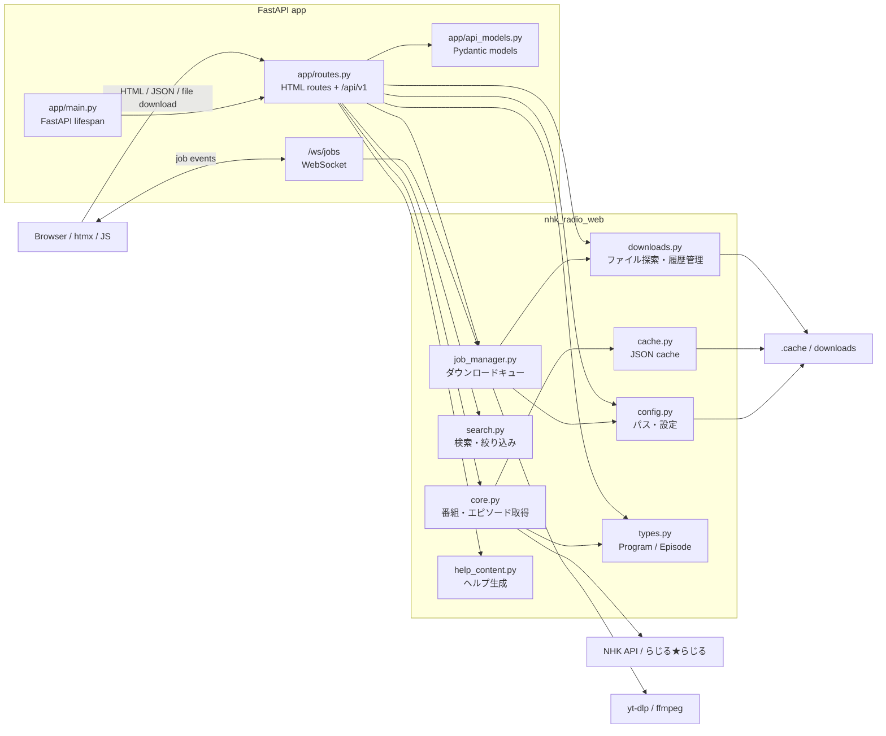

# NHK ラジオ聞き逃し Web (FastAPI + htmx)

`radio` (Tkinter GUI) を FastAPI + htmx で書き直した Web アプリ。
Tkinter 版の豊富な機能を Web に移植しました。

## 目次

- [必要条件](#必要条件)
- [セットアップ](#セットアップ)
- [起動](#起動)
- [API ドキュメント](#api-ドキュメント)
- [JSON API (`/api/v1`)](#json-api-apiv1)
- [機能](#機能)
- [操作方法](#操作方法)
- [キーボードショートカット](#キーボードショートカット)
- [テスト・カバレッジ](#テストカバレッジ)
  - [実行方法](#実行方法)
  - [計測結果](#計測結果)
- [環境変数](#環境変数)
- [ソフトウェア構成 (Mermaid)](#ソフトウェア構成-mermaid)
- [プロジェクト構成](#プロジェクト構成)
- [ライセンス・規約](#ライセンス規約)

---

## 必要条件

- Python 3.13+
- [uv](https://docs.astral.sh/uv/)
- ffmpeg (ダウンロード時)

## セットアップ

```bash
cd radio-web
uv sync
```

## 起動

```bash
uv run uvicorn app.main:app --reload
```

ブラウザで <http://localhost:8000> を開く。

## API ドキュメント

起動後、FastAPI の自動生成ドキュメントを利用できます。

- Swagger UI: <http://localhost:8000/docs>
- ReDoc: <http://localhost:8000/redoc>
- OpenAPI JSON: <http://localhost:8000/openapi.json>

## JSON API (`/api/v1`)

外部クライアント連携向けに、型付き JSON API を用意しています。

| Method | Path | 用途 |
| --- | --- | --- |
| `GET` | `/api/v1/health` | 稼働確認 |
| `GET` | `/api/v1/meta` | API メタ情報 |
| `GET` | `/api/v1/genres` | ジャンル一覧（`unclassified` を含む） |
| `GET` | `/api/v1/programs` | 番組一覧・検索 |
| `GET` | `/api/v1/programs/{program_id}` | 番組詳細 |
| `GET` | `/api/v1/programs/{program_id}/episodes` | エピソード一覧 |
| `GET` | `/api/v1/programs/{program_id}/episodes/{episode_id}` | エピソード詳細 |
| `POST` | `/api/v1/download-jobs` | ダウンロードジョブ作成 |
| `GET` | `/api/v1/download-jobs` | ジョブ一覧 |
| `GET` | `/api/v1/download-jobs/{job_id}` | ジョブ詳細 |
| `DELETE` | `/api/v1/download-jobs/{job_id}` | ジョブキャンセル |
| `GET` | `/api/v1/download-jobs/{job_id}/file` | 完了ファイル取得 |
| `GET` | `/api/v1/settings` | 設定取得 |
| `PUT` | `/api/v1/settings` | 設定更新 |

## 機能

### Phase A: コア UX パリティ

- ✅ **フリーワード検索**: 番組名・コーナー名で横断検索
- ✅ **ジャンルフィルタ**: NHK ジャンル + **未分類** に対応
- ✅ **エピソード検索・ソート**: タイトル・放送日・保存状況で柔軟に絞り込み
- ✅ **進捗詳細**: ダウンロード中の % / ETA / 速度をリアルタイム表示
- ✅ **キャンセル機能**: 実行中ジョブを即座に停止

### Phase B: 一括ダウンロード・キュー・リトライ

- ✅ **複数選択 DL**: チェックボックスで複数エピソードを同時キュー登録
- ✅ **同時実行制御**: デフォルト最大 2 並行ダウンロード（環境変数で調整可）
- ✅ **自動リトライ**: 失敗時に 3 回まで指数バックオフ (1s, 2s, 4s) で再試行
- ✅ **全キャンセル**: `/downloads` ページから全実行中ジョブを一括キャンセル

### Phase C: UX 仕上げ

- ✅ **テーマ切替**: ライト・ダークモード（localStorage で永続化）
- ✅ **フォントサイズ**: 3 段階調整（S / M / L）
- ✅ **ヘルプページ**: Markdown ベースの充実したヘルプ（`/help`）
- ✅ **広いエピソード一覧ダイアログ**: 幅拡大 + はっきりした枠線
- ✅ **キーボードショートカット**: `/` 検索、`?` ヘルプ、`Esc` 閉じる、`g` ジャンル
- ✅ **キャッシュ管理**: 番組・エピソード情報の手動クリア
- ✅ **FastAPI native API**: Pydantic モデル・`response_model`・`Depends` を利用した `/api/v1`

### Phase D: HLS ストリーミング（基盤実装）

- ✅ **HLS デコード基盤**: AES-128-CBC 復号プロキシ
- ⚠️ ブラウザ内試聴: 将来の統合に向けた `streaming.py` 実装済み

## 操作方法

| 操作 | 説明 |
| --- | --- |
| ジャンル選択 | サイドバーから絞り込み |
| 番組カードをクリック | エピソード一覧を展開 |
| キーワード入力 | リアルタイムで番組・エピソードを検索 |
| ソート選択 | 放送日・タイトル・保存状況で並べ替え |
| [DL] ボタン | 単発ダウンロード開始 |
| エピソードにチェック | 複数選択（一括 DL で利用） |
| [一括 DL] ボタン | 選択したエピソードをキューに登録 |
| `/downloads` | 全ジョブの詳細確認・キャンセル |
| [ヘルプ] リンク | 操作方法・トラブルシューティング |

## キーボードショートカット

| キー | 機能 |
| --- | --- |
| `/` | 検索ボックスにフォーカス |
| `?` or `F1` | ヘルプを表示 |
| `Esc` | モーダル・メニューを閉じる |
| `g` | ジャンルフィルタにフォーカス |

## テスト・カバレッジ

### 実行方法

```bash
# 通常実行 (term-missing 表示)
bash scripts/test.sh

# HTML レポートも生成
bash scripts/test.sh --html
# → htmlcov/index.html をブラウザで開く
```

目標カバレッジ: **100%** (強制)

### 計測結果

> 実行日: 2026-05-28 / Python 3.13.13 / pytest 9.0.3

```text
248 passed in 26.75s
```

| ファイル | Stmts | Miss | カバレッジ |
| --- | ---: | ---: | ---: |
| `app/api_models.py` | 140 | 0 | **100%** |
| `app/main.py` | 27 | 0 | **100%** |
| `app/routes.py` | 387 | 0 | **100%** |
| `nhk_radio_web/__init__.py` | 1 | 0 | **100%** |
| `nhk_radio_web/cache.py` | 101 | 0 | **100%** |
| `nhk_radio_web/config.py` | 66 | 0 | **100%** |
| `nhk_radio_web/constants.py` | 13 | 0 | **100%** |
| `nhk_radio_web/core.py` | 262 | 0 | **100%** |
| `nhk_radio_web/downloads.py` | 314 | 0 | **100%** |
| `nhk_radio_web/help_content.py` | 12 | 0 | **100%** |
| `nhk_radio_web/job_manager.py` | 128 | 0 | **100%** |
| `nhk_radio_web/progress.py` | 15 | 0 | **100%** |
| `nhk_radio_web/search.py` | 37 | 0 | **100%** |
| `nhk_radio_web/streaming.py` | 61 | 0 | **100%** |
| `nhk_radio_web/text.py` | 134 | 0 | **100%** |
| `nhk_radio_web/types.py` | 59 | 0 | **100%** |
| **TOTAL** | **1757** | **0** | **100%** |

**注記:**

- Windows 向けパス分岐 (`os.name == "nt"`) は macOS で実行不可のため `# pragma: no cover` でスキップ

## 環境変数

| 変数 | 説明 | デフォルト |
| --- | --- | --- |
| `NHK_RADIO_CACHE_DIR` | キャッシュ保存先 | `<project>/.cache` |
| `NHK_RADIO_DOWNLOAD_DIR` | ダウンロード先 | `<project>/downloads` |
| `NHK_RADIO_MAX_CONCURRENT_DL` | 最大並行ダウンロード数 | `2` |

## ソフトウェア構成 (Mermaid)



## プロジェクト構成

```text
radio-web/
├── app/
│   ├── api_models.py    # FastAPI 用 Pydantic request/response モデル
│   ├── main.py          # FastAPI インスタンス・lifespan・JobManager 起動
│   └── routes.py        # HTML ルート + /api/v1 JSON API
├── src/nhk_radio_web/
│   ├── types.py         # Program / Episode dataclass
│   ├── constants.py     # NHK API URL・ジャンル・リトライ設定
│   ├── core.py          # 番組・エピソード取得ロジック
│   ├── cache.py         # JSON キャッシュ (TTL 付き・スキーマ管理)
│   ├── downloads.py     # ダウンロード追跡・yt-dlp コマンド生成
│   ├── job_manager.py   # 並行ジョブ管理・Semaphore・リトライロジック
│   ├── progress.py      # yt-dlp 進捗パース
│   ├── search.py        # 番組・エピソード検索・ソート・フィルタ
│   ├── streaming.py     # HLS AES-128-CBC 復号プロキシ（基盤）
│   ├── text.py          # テキスト整形ユーティリティ
│   ├── help_content.py  # ヘルプ Markdown→HTML 変換
│   └── config.py        # パス解決・環境変数
├── templates/
│   ├── base.html                      # レイアウト・テーマ切替・フォントサイズ
│   ├── index.html                     # ジャンルフィルタ・番組グリッド
│   ├── help.html                      # ヘルプページ
│   ├── downloads.html                 # ジョブ一覧ページ
│   └── partials/
│       ├── program_list.html          # 番組カード
│       ├── episode_list.html          # エピソード一覧・複数選択対応
│       └── download_status.html       # ステータス表示・進捗バー
├── static/
│   ├── css/themes.css                 # light/dark テーマ・フォントサイズ
│   └── js/app.js                      # テーマ切替・検索履歴・ショートカット
├── tests/                             # pytest テスト（248 件 / 100% カバレッジ）
│   ├── test_*.py                      # 各モジュール対応テスト
│   └── test_coverage_gaps.py          # カバレッジ不足行の追加テスト
├── help.md                            # ヘルプコンテンツ（Markdown）
├── scripts/test.sh                    # テスト実行スクリプト
└── pyproject.toml                     # プロジェクト設定・依存関係
```

## ライセンス・規約

このアプリケーションは **個人利用目的のみ** を想定しています。

- NHK「らじる★らじる」の [利用規約](https://www.nhk.or.jp/radio/ondemand/) に従う
- ダウンロードしたコンテンツの無断配信・アップロードは禁止
- 個人的な学習・聴取目的での利用を前提
