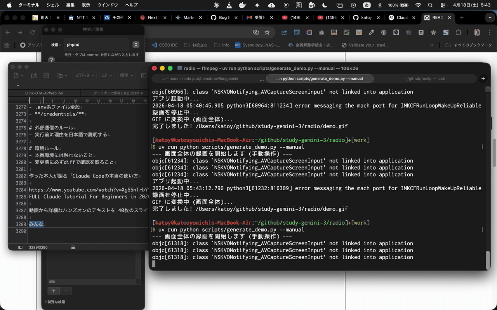

# NHK ラジオ聞き逃しダウンローダー

NHK ラジオの聞き逃し番組を一覧表示し、番組ごとにエピソードを選んで保存できる Python スクリプトです。GUI で番組を探して複数話をまとめて保存する使い方と、URL を直接指定して保存する使い方の両方に対応しています。

## 動作デモ


## ⚠️ 重要: 注意事項

- **著作権について**: 本ツールは、個人利用や著作権法で認められた範囲での利用を前提としています。ダウンロードした音声の再配布や公開は行わないでください。
- **外部コマンド依存**: 実際の取得処理には `yt-dlp` を使用します。事前にインストールが必要です。
- **GUI について**: 番組一覧ブラウザは `tkinter` を使います。Python 実行環境に `tkinter` が入っていない場合、GUI モードは起動できません。

## 特徴

- **番組一覧を GUI で閲覧**: 番組一覧を表示し、検索とジャンル絞り込みを使いながら対象番組を選べます。
- **エピソード一覧を取得して複数選択**: 選択した番組の配信回一覧を取得し、検索・保存済みフィルタを使いながら必要な回だけまとめて保存できます。
- **URL 直接指定にも対応**: 番組 URL を引数で渡して、そのまま保存できます。
- **キャッシュ付き**: 番組一覧・エピソード一覧を `.cache/` に保持し、再取得を減らします。取得失敗時は期限切れキャッシュも再利用します。
- **重複保存を回避**: 保存済みファイルと `.downloaded.json` を使って、ダウンロード済みエピソードを追跡します。
- **高速な GUI レンダリング**: バッチファイルスキャン、マニフェストキャッシング（mtime 検証）により、複数エピソード表示時の N+1 I/O 問題を解決しています。
- **複数同時ダウンロード対応**: 並行ダウンロード時も 50ms の短い polling 間隔で即座に進捗更新。プロセスハング防止のため 120 秒タイムアウトを設定。
- **macOS ダークモード対応**: OS の外観に合わせたテーマ切り替えと、高視認性を追求した独自のデザイン（黒潰れ・白飛び対策済み）を採用しています。
- **製品寄りの操作導線**: ヘルプダイアログ、キーボードショートカット、保存済みエピソード行の `☑` マークからワンクリックで保存先フォルダを開く機能を備えています。

## 動作環境

- **Python**: 3.13 以上
- **外部コマンド**: `yt-dlp`
- **Python 標準ライブラリ**: `tkinter` を含む通常の Python 環境

## セットアップ

### 1. リポジトリを配置

このディレクトリに移動します。

```bash
cd radio
```

### 2. 依存をインストール

```bash
uv sync
```

`pyproject.toml` の依存を仮想環境に同期します。

package として入れる場合は:

```bash
uv pip install -e .
```

コマンドを直接入れたい場合は:

```bash
brew install yt-dlp
```

### 3. 実行確認

```bash
python3 nhk_radio_dl.py --help
```

### 4. テスト実行

```bash
uv run python -m pytest tests/
```

### 5. デモ動画の生成 (macOS)

アプリの操作デモ（GIF）を自動生成できます。

```bash
# 自動操作シナリオで生成
uv run python scripts/generate_demo.py

# 手動操作を録画して生成 (アプリを閉じると終了)
uv run python scripts/generate_demo.py --manual
```

※ macOS の「画面収録」と「アクセシビリティ」の許可が必要です。

## 使い方

### GUI で番組を選んで保存

```bash
python3 nhk_radio_dl.py
```

- 上段で番組を選択
- 左側で検索・ジャンル絞り込み
- ダブルクリックまたは Enter 相当の操作でエピソード一覧を取得
- 右側でエピソード検索・保存済みのみ表示
- 下段で複数選択してダウンロード
- `Ctrl/Cmd+F`, `Ctrl/Cmd+L`, `F`, `D`, `F1` で主要操作をショートカットできます

### URL を直接指定して保存

```bash
python3 nhk_radio_dl.py "https://www.nhk.or.jp/radio/ondemand/detail.html?p=XXXX_01"
```

### 直近 N 件だけ保存

```bash
python3 nhk_radio_dl.py "https://www.nhk.or.jp/radio/ondemand/detail.html?p=XXXX_01" -n 5
```

### 保存先ディレクトリを変更

```bash
python3 nhk_radio_dl.py -o ~/Downloads/nhk
```

### 特定ジャンルだけ表示

```bash
python3 nhk_radio_dl.py -g language
```

### キャッシュを削除

```bash
python3 nhk_radio_dl.py --clear-cache
```

この操作では番組一覧・エピソード一覧のキャッシュを削除します。GUI 設定（テーマ・フォントサイズ・検索履歴）は削除されません。

## オプション

- `url`: 番組 URL。省略時は GUI モード
- `--output-dir`, `-o`: 保存先ディレクトリ (デフォルト: `./downloads`)
- `--max-items`, `-n`: 最大ダウンロード件数
- `--keep-video`: 音声変換せず元ファイルを保持
- `--clear-cache`: 番組一覧・エピソード一覧のキャッシュを削除して終了（GUI 設定は削除されません）
- `--genre`, `-g`: `language`, `music`, `news`, `drama`, `sports`, `documentary`, `variety` のいずれかで絞り込み
- `--verbose`, `-v`: 詳細なログを出力する

## 保存先

デフォルトでは次のように保存されます。

```text
downloads/
└── <site_id>_<corner_id>/
    ├── YYYYMMDD_<番組名>_<回タイトル>.mp3
    └── .downloaded.json
```

`-n` を付けて複数件ダウンロードする場合、先頭にプレイリスト順の番号が付くことがあります。

過去の `<ジャンル>/<番組名>/` 配下に保存済みのファイルも、再検出できるよう互換 lookup を残しています。

## パフォーマンス・最適化

本アプリケーションは以下の最適化により、GUI での快適な操作感を実現しています：

### キャッシュ戦略
- **マニフェストキャッシング** (10 秒 TTL + mtime 検証): ダウンロード履歴の再度読み込み時 I/O を削減。ファイル更新を自動検出して古いキャッシュを無効化。
- **ファイルスキャンキャッシング** (100 エントリ上限): ディレクトリ走査結果を保持。mtime 変化で自動無効化。
- **プログラム一覧キャッシュ**: 期限切れ時も再利用可能。ネットワーク障害時のフォールバック機能を実装。

### バッチ処理
- **バッチダウンロード判定**: `get_downloaded_episode_keys()` で複数エピソードの保存状態を 1 回のマニフェスト読み込みで判定。GUI レンダリング時の N+1 I/O 問題を解決。

### 並行ダウンロード対応
- **動的ポーリング間隔**: ダウンロード数に応じて自動調整（3+ 件で 50ms、1-2 件で 100ms）。複数同時ダウンロード時の応答性とシングルダウンロード時の CPU 効率を両立。
- **プロセスタイムアウト** (120 秒): 応答不能な yt-dlp プロセスを強制終了。UI のハングを防止。

### ネットワーク負荷削減
- **yt-dlp リトライ削減**: socket_timeout 30 秒、retries 2 回。従来の 10 分近い多重リトライを最大 60 秒に短縮。
- **エラーリカバリ**: フェッチ失敗時も期限切れキャッシュを再利用。ユーザー体験の中断を最小化。

### 信頼性
- **原子的マニフェスト保存**: `tempfile.mkstemp` + `Path.replace` による安全な書き込み。プロセスクラッシュ時のマニフェスト破損を防止。

## キャッシュ

- 番組一覧キャッシュ: `.cache/programs/`
- エピソード一覧キャッシュ: `.cache/episodes/`
- GUI 設定: `.cache/ui_settings.json`

GUI のテーマ、文字サイズ、検索履歴もキャッシュ配下に保存されます。

package としてインストールして実行する場合は、キャッシュ保存先は OS 標準のユーザーキャッシュディレクトリに切り替わります。必要に応じて `NHK_RADIO_CACHE_DIR` で明示指定できます。

ファイルスキャンキャッシュの容量は環境変数 `NHK_RADIO_FILE_SCAN_CACHE_SIZE` で調整可能です（デフォルト: 100）。

番組 API の実装ベース仕様は `API.md` を参照してください。

## トラブルシューティング

### `yt-dlp` が見つからない

`yt-dlp` のインストール後、ターミナルを開き直すか、`yt-dlp --version` が通ることを確認してください。

### GUI を起動できない

- `python3 -m tkinter` が起動するか確認してください。
- `tkinter` を含まない Python を使っている場合は、標準の Python 実行環境を使ってください。

### ダウンロード済み扱いになる / 同じ回を再取得したい

保存先にある音声ファイルと `.downloaded.json` の両方が判定に使われます。必要なら対象番組ディレクトリ内のファイルや `.downloaded.json` を整理してください。

## ファイル構成

```text
radio/
├── API.md           # 番組 API の実装ベース仕様
├── nhk_radio_dl.py  # ソースツリー実行用ラッパー (src/nhk_radio.cli を呼び出す)
├── README.md        # このドキュメント
├── pyproject.toml   # uv / pip 用の依存・メタデータ
├── requirements.txt # 実行時の Python 依存
├── src/
│   └── nhk_radio/   # アプリ本体 package
│       ├── __main__.py  # `python -m nhk_radio` エントリ
│       ├── cli.py       # コマンドライン引数処理と対話モード
│       ├── core.py      # 番組一覧 / エピソード取得ロジック
│       ├── cache.py     # 一覧キャッシュ (TTL 付き)
│       ├── config.py    # 設定と UI 設定パス
│       ├── constants.py # API エンドポイント・ジャンル定数
│       ├── downloads.py # yt-dlp 実行・保存先管理・重複判定・マニフェスト管理
│       │                 # - run_yt_dlp_subprocess() 統一サブプロセス管理
│       │                 # - get_downloaded_episode_keys() バッチ判定
│       │                 # - マニフェストキャッシング (mtime 検証付き)
│       ├── text.py      # 表示整形ユーティリティ
│       ├── types.py     # Program / Episode の dataclass 定義
│       ├── help.md      # GUI ヘルプ本文
│       └── gui/         # Tkinter GUI (mixin 構成)
│           ├── download_manager.py # 並行ダウンロード管理・進捗追跡
│           ├── downloads.py        # ダウンロード UI 更新・動的ポーリング
├── scripts/         # デモ動画生成スクリプト等
├── tests/           # pytest ベースの回帰テスト
├── .cache/          # 番組一覧・エピソード一覧・UI 設定キャッシュ
└── downloads/       # ダウンロード保存先
```


## テストカバレッジ

全 205 個の回帰テスト（pytest）により、主要機能の品質を保証しています。カバレッジは自動計測され、各コミット時に検証されます。

<!-- COVERAGE-BEGIN -->
最終計測: 2026-05-15

| モジュール | ステートメント数 | カバレッジ |
|:----------|----------------:|----------:|
| `__init__.py` | 0 | 100% |
| `__main__.py` | 3 | 100% |
| `cache.py` | 100 | 100% |
| `cli.py` | 195 | 100% |
| `config.py` | 141 | 100% |
| `constants.py` | 10 | 100% |
| `core.py` | 215 | 100% |
| `downloads.py` | 378 | 91% |
| `gui/__init__.py` | 2 | 100% |
| `gui/browser.py` | 286 | 54% |
| `gui/build.py` | 320 | 100% |
| `gui/data_manager.py` | 62 | 35% |
| `gui/download_manager.py` | 81 | 64% |
| `gui/downloads.py` | 248 | 57% |
| `gui/help_markdown.py` | 134 | 99% |
| `gui/listing.py` | 501 | 54% |
| `gui/logic.py` | 53 | 0% |
| `gui/logo.py` | 34 | 91% |
| `gui/styling.py` | 114 | 65% |
| `gui/theme_manager.py` | 109 | 93% |
| `gui/toolkit.py` | 14 | 64% |
| `text.py` | 134 | 100% |
| `types.py` | 12 | 100% |
| **合計** | **3146** | **78%** |
<!-- COVERAGE-END -->
## ライセンス

特に明記がなければ、このディレクトリのコードはリポジトリ全体の扱いに従ってください。
